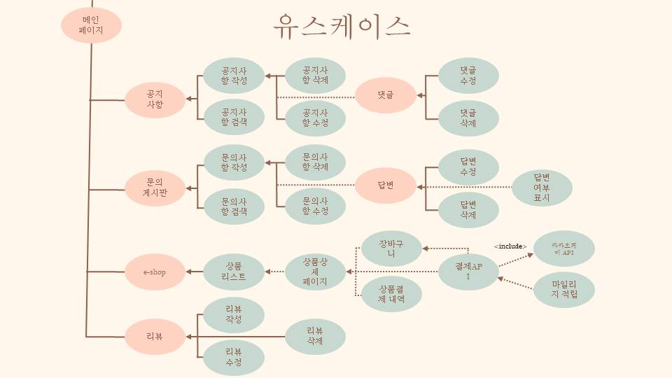

# 초특가 여기어때 (호텔예약프로그램)

   
  
   

## 프로젝트 소개

- 초특가 여기어때 프로젝트는 웹 사이트에서 호텔을 예약,결제 및 해당 호텔에대한 전반적인 설명들을 알수있는 웹 프로젝트입니다.
  
- 진행기간 : 2023년 11월 14일 → 2023년 12월 21일 의 기간동안 진행했습니다.

 

## 팀원소개 & 기능

   
  
   

 

## ERD CLOUD

   
  
   

## 기술 스택

   
  
   

## 유스케이스

   
  
   

   
  
   

 

## 내 기능 구현

#### 1.  객실소개 & 결제기능 & 마일리지기능 & 예약여부확인 
### 1) 홈
|🔗 [splash](https://github.com/13oosters/project-sns-react/wiki/%F0%9F%93%83-%ED%8E%98%EC%9D%B4%EC%A7%80-%EC%83%81%EC%84%B8-%EC%84%A4%EB%AA%85#-splash)|🔗 [1. 객실,결제,마일리지]([https://github.com/13oosters/project-sns-react/wiki/%F0%9F%93%83-%ED%8E%98%EC%9D%B4%EC%A7%80-%EC%83%81%EC%84%B8-%EC%84%A4%EB%AA%85#-%EB%A1%9C%EA%B7%B8%EC%9D%B8-%ED%8E%98%EC%9D%B4%EC%A7%80](https://github.com/aa6488/Portfolio-Semi-Project/blob/master/gif/e-SHOP%EA%B2%B0%EC%A0%9C.gif))

|:-:|:-:|:-:|
| |||

|🔗 [홈 페이지](https://github.com/13oosters/project-sns-react/wiki/%F0%9F%93%83-%ED%8E%98%EC%9D%B4%EC%A7%80-%EC%83%81%EC%84%B8-%EC%84%A4%EB%AA%85#-%ED%99%88-%ED%8E%98%EC%9D%B4%EC%A7%80)
|🔗 [검색 페이지](https://github.com/13oosters/project-sns-react/wiki/%F0%9F%93%83-%ED%8E%98%EC%9D%B4%EC%A7%80-%EC%83%81%EC%84%B8-%EC%84%A4%EB%AA%85#-%EA%B2%80%EC%83%89-%ED%8E%98%EC%9D%B4%EC%A7%80)|
|:-:|:-:|
|||

 

- ㅁㄴㅇ

 

#### 2. 상단배너 예약기능

- ㅁㄴㅇ

 

#### 3. E-SHOP 상품결제, 장바구니 , 결제완료내역

- ㅁㄴㅇㅁㄴㅇ
 

## 배운 점 & 아쉬운 점

- ㅁㄴㅇㅁㄴㅇ

 

