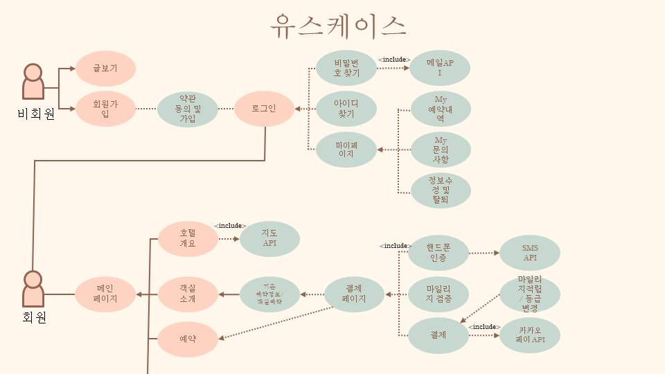

# 초특가 여기어때 (호텔예약프로그램)

   
  
   

## 프로젝트 소개

- 초특가 여기어때 프로젝트는 웹 사이트에서 호텔을 예약,결제 및 해당 호텔에대한 전반적인 설명들을 알수있는 웹 프로젝트입니다.
  
- 진행기간 : 2023년 11월 14일 → 2023년 12월 21일 의 기간동안 진행했습니다.

 

## 팀원소개 & 기능

   
  
   

 

## ERD CLOUD

   
  
   

## 기술 스택

   
  
   

## 유스케이스

   
  
   

   
  
   

 

## 내 기능 구현
#### 상세 기능 설명은 각 페이지별 링크 연결해두었습니다.
#### [1.  객실소개 & 결제기능 & 마일리지기능 & 예약여부확인](https://github.com/aa6488/Portfolio-Semi-Project/wiki/%F0%9F%93%83-%EA%B8%B0%EB%8A%A5-%EC%83%81%EC%84%B8%EC%84%A4%EB%AA%85#1-%EA%B0%9D%EC%8B%A4%EC%86%8C%EA%B0%9C)  

 

 

#### [2. 상단배너 예약기능](https://github.com/aa6488/Portfolio-Semi-Project/wiki/%F0%9F%93%83-%EA%B8%B0%EB%8A%A5-%EC%83%81%EC%84%B8%EC%84%A4%EB%AA%85#5-%EC%83%81%EB%8B%A8%EB%B0%B0%EB%84%88-%EC%98%88%EC%95%BD%EA%B8%B0%EB%8A%A5)
 

 

#### [3. E-SHOP 상품결제, 장바구니 , 결제완료내역](https://github.com/aa6488/Portfolio-Semi-Project/wiki/%F0%9F%93%83-%EA%B8%B0%EB%8A%A5-%EC%83%81%EC%84%B8%EC%84%A4%EB%AA%85#6-e-shop-%EC%83%81%ED%92%88%EA%B2%B0%EC%A0%9C-%EC%9E%A5%EB%B0%94%EA%B5%AC%EB%8B%88--%EA%B2%B0%EC%A0%9C%EC%99%84%EB%A3%8C%EB%82%B4%EC%97%AD)
 

 

## 배운 점 & 아쉬운 점

- ㅁㄴㅇㅁㄴㅇ

 

