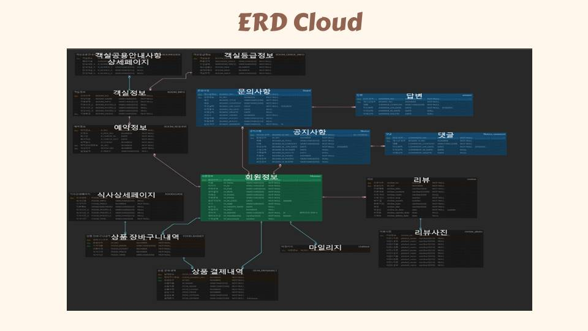

# 초특가 여기어때 (호텔예약프로그램)

   
  
   

## 프로젝트 소개

- 초특가 여기어때 프로젝트는 웹 사이트에서 호텔을 예약,결제 및 해당 호텔에대한 전반적인 설명들을 알수있는 웹 프로젝트입니다.
  
- 진행기간 : 2023년 11월 14일 → 2023년 12월 21일 의 기간동안 진행했습니다.

 

## 팀원소개 & 기능

   
  
   

 

## ERD CLOUD

   
  
   

## 기술 스택

   
  
   

## 유스케이스

   
  
   

   
  
   

 

## 내 기능 구현
#### 상세 기능 설명은 각 페이지별 링크 연결해두었습니다.
#### [1.  객실소개 & 결제기능 & 마일리지기능 & 예약여부확인](https://github.com/aa6488/Portfolio-Semi-Project/wiki/%F0%9F%93%83-%EA%B8%B0%EB%8A%A5-%EC%83%81%EC%84%B8%EC%84%A4%EB%AA%85#1-%EA%B0%9D%EC%8B%A4%EC%86%8C%EA%B0%9C)  

 

 

#### [2. 상단배너 예약기능](https://github.com/aa6488/Portfolio-Semi-Project/wiki/%F0%9F%93%83-%EA%B8%B0%EB%8A%A5-%EC%83%81%EC%84%B8%EC%84%A4%EB%AA%85#5-%EC%83%81%EB%8B%A8%EB%B0%B0%EB%84%88-%EC%98%88%EC%95%BD%EA%B8%B0%EB%8A%A5)
 

 

#### [3. E-SHOP 상품결제, 장바구니 , 결제완료내역](https://github.com/aa6488/Portfolio-Semi-Project/wiki/%F0%9F%93%83-%EA%B8%B0%EB%8A%A5-%EC%83%81%EC%84%B8%EC%84%A4%EB%AA%85#6-e-shop-%EC%83%81%ED%92%88%EA%B2%B0%EC%A0%9C-%EC%9E%A5%EB%B0%94%EA%B5%AC%EB%8B%88--%EA%B2%B0%EC%A0%9C%EC%99%84%EB%A3%8C%EB%82%B4%EC%97%AD)
 

 

## 배운 점 & 아쉬운 점

  
-  프로젝트를 진행하면서 먼저 코드를 작성하기 이전에 팀원들과 회의를통한 기능, 구현정도 등 초기에 진행하는 사항들이 얼마나 중요한지 많이 느끼게되었다.  또 코드를 작성하면서 git , github 로 협업을 진행하게되었는데 처음엔 이런걸 꼭 써야하나 ? 라고 생각을하였지만 몇번쓰다보니 엄청 편리하게 만들어져 있었고 또 많이 유용하게 사용했던것같다
  
- 기능 부분에서도 처음에 구현예정이였던 기능들을 기간을 잘못설정했던거같다. 처음엔 이정도까지 하면 시간맞겠지 라는 막연한생각으로 진행을하였지만 시간이 남게되었고 그이후 회의를통해 e-shop 부분을 추가하겠다 고 했을때에도 시간이 될것같았지만 결국엔 다른 웹 쇼핑몰처럼 완벽하게 완성하지못한채로 프로젝트를 마무리하게되었다.   이번 프로젝트를 통해 시간, 맡은 기능에따른 시간분배 에대해 많이 생각하게되었고 또 많이 배웠던것같다.

- 내가 작성한 코드들에대해 더 깊게 들어갈수록 연계된, 연관된 한번도 사용해보지못한 코드들이 많이보이게되었는데 이로인해 내가 더욱 열심히해야겠다고 생각을하였고 시간이 어느정도 걸릴지는 모르겠지만, 언젠가 새로운 코드를 보더라도 한눈에 알아볼수 있는 실력을 갖출수 있을때 까지 진전해 나아갈것이다.

- <strong>작성일 2024-02-29 이희수</strong> 

 

