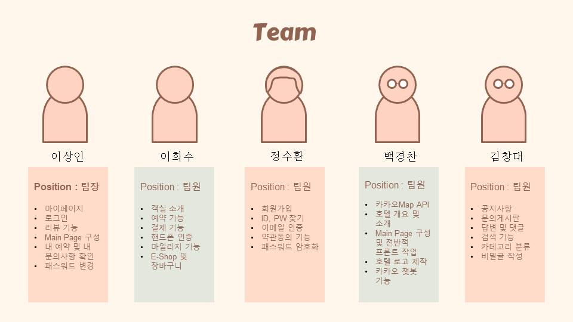

# 초특가 여기어때 (호텔예약프로그램)

   
  
   

## 프로젝트 소개

- 초특가 여기어때 프로젝트는 웹 사이트에서 호텔을 예약,결제 및 해당 호텔에대한 전반적인 설명들을 알수있는 웹 프로젝트입니다.
  
- 진행기간 : 2023년 11월 14일 → 2023년 12월 21일 의 기간동안 진행했습니다.

 

## 팀원소개 & 기능

   
  
   

 

## ERD CLOUD

   
  
   

## 기술 스택

   
  
   

## 유스케이스

   
  
   

   
  
   

 

## 내 기능 구현

#### [1.  객실소개 & 결제기능 & 마일리지기능 & 예약여부확인]()  

| |

 

- ㅁㄴㅇ

 

#### 2. 상단배너 예약기능
| |
- ㅁㄴㅇ

 

#### 3. E-SHOP 상품결제, 장바구니 , 결제완료내역
| |

- ㅁㄴㅇㅁㄴㅇ
 

## 배운 점 & 아쉬운 점

- ㅁㄴㅇㅁㄴㅇ

 

